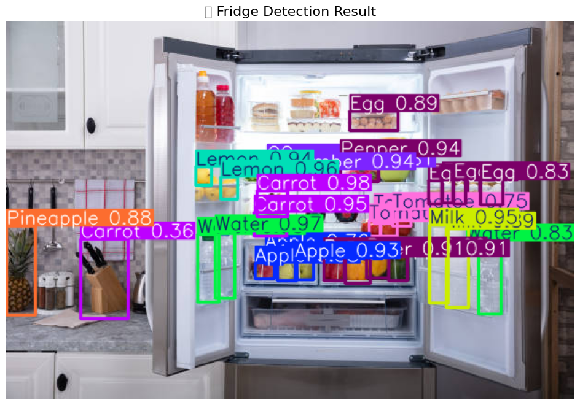
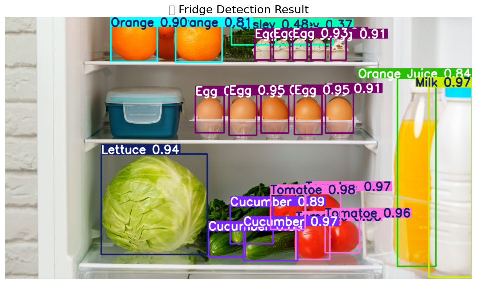
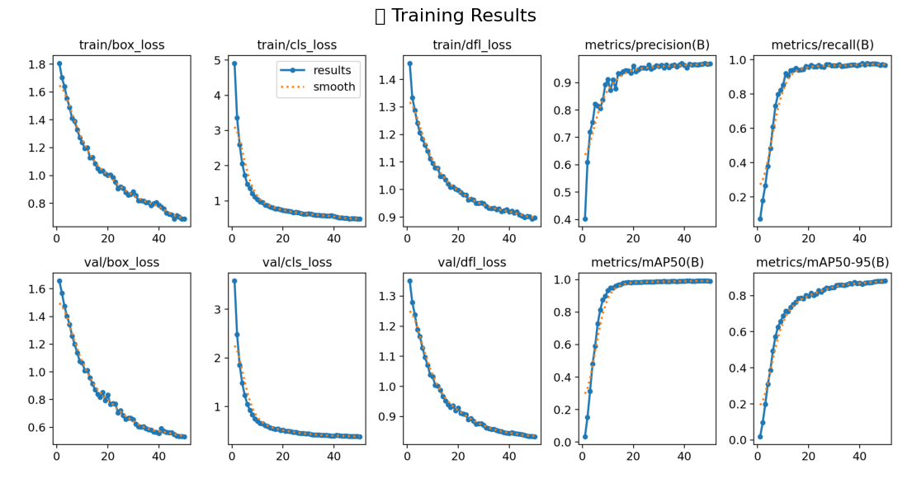
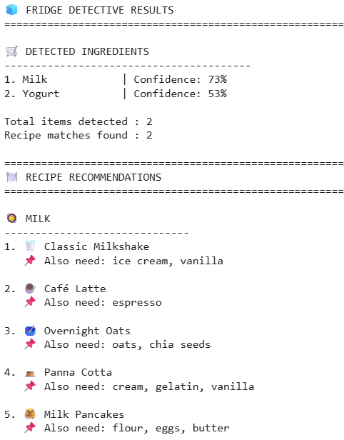
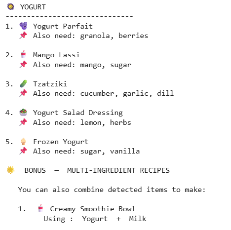

# 🍎 AI-Powered Fruit & Vegetable Detection and Recipe Recommendation System

## 📌 Overview

This project combines Computer Vision and Recommendation Systems to detect fruits, vegetables, and common refrigerator items from images and recommend recipes based on the detected ingredients.

The object detection model was trained using YOLOv8 on an augmented custom dataset, while the recommendation module suggests relevant recipes using the identified food items.

---

## 🎯 Features

* Real-time fruit and vegetable detection
* Multi-object detection using YOLOv8
* Bounding box visualization with confidence scores
* Recipe recommendations based on detected ingredients
* Dataset augmentation using Albumentations
* Performance evaluation using standard object detection metrics

---

## 🗂 Dataset Information

**Source:** Roboflow Universe (Fridge Items Dataset)

| Attribute       | Details        |
| --------------- | -------------- |
| Original Images | 33             |
| Classes         | 67             |
| Annotation Type | Bounding Boxes |
| Format          | YOLOv8         |
| Original Split  | Train Only     |

### Data Augmentation

To improve model generalization and overcome dataset limitations, Albumentations was used to generate additional training samples.

**Augmentation Techniques:**

* Horizontal Flip
* Random Brightness Adjustment
* Rotation (±15°)
* Gaussian Blur
* Hue-Saturation-Value Transformation
* Random Scaling

| Dataset Size        | Images |
| ------------------- | ------ |
| Before Augmentation | 33     |
| After Augmentation  | 528    |
| Expansion           | 16×    |

---

## 🛠 Technologies Used

* Python
* YOLOv8
* PyTorch
* OpenCV
* Albumentations
* Roboflow
* Google Colab

---

## ⚙️ Methodology

1. Collected and prepared the Fridge Items dataset from Roboflow.
2. Applied Albumentations-based augmentation to expand the dataset.
3. Trained a YOLOv8 object detection model on the augmented dataset.
4. Evaluated model performance using precision, recall, and mAP metrics.
5. Developed a recipe recommendation module based on detected ingredients.
6. Integrated detection and recommendation into a single workflow.

---

## 📊 Model Performance

### Training Results

| Metric    | Value |
| --------- | ----- |
| Precision | ~96%  |
| Recall    | ~97%  |
| mAP@50    | ~99%  |
| mAP@50-95 | ~89%  |

### Training Observations

* Training and validation losses decreased consistently.
* Precision and recall converged to high values.
* The model achieved strong object localization and classification performance.
* Data augmentation significantly improved robustness and generalization.

---

## 🖼 Sample Results

The trained model successfully detected multiple refrigerator items including:

* Apples
* Oranges
* Tomatoes
* Cucumbers
* Lettuce
* Eggs
* Milk
* Juice Bottles
* Carrots
* Lemons

Detection outputs include bounding boxes and confidence scores for each identified object.

## Detection Results

## Training Performance

## Recipe Recommendation Results

## 👨‍💻 My Contribution

I played the primary role in developing the project. My contributions included dataset preparation, image augmentation using Albumentations, YOLOv8 model training and evaluation, performance analysis, and integration of the recipe recommendation module while collaborating with my teammates throughout the project.

---

## 🚀 Future Improvements

* Increase dataset diversity and size
* Real-time webcam-based detection
* Mobile application deployment
* Personalized recipe recommendations
* Nutritional analysis of recommended recipes

---

## 📚 Domain

Computer Vision (CV) + Recommendation Systems
